<div align="center">

# Maison Lucas Customer Ordering

**A mobile-first QR ordering experience connected directly to live restaurant operations.**


</div>

---

## Overview

This web application lets dine-in guests scan the permanent QR identity of an open table, select language and allergens, browse the current menu, submit orders and review the live bill. It uses the same backend data as the POS and kitchen display, preventing separate prices or order copies.

## Guest journey

```mermaid
flowchart LR
    Scan["Scan table QR"] --> Validate["Validate active table session"]
    Validate --> Welcome["Language and allergy preferences"]
    Welcome --> Menu["Browse available menu"]
    Menu --> Cart["Review cart and serving sequence"]
    Cart --> Order["Submit to POS and kitchen"]
    Order --> Bill["View ordered items and live bill"]
    Bill --> Pay["Voucher and verified bank transfer"]
```



## Experience features

- Camera QR scanning with direct-link fallback
- Access only while the table is open
- Eight-language preference shared with the POS
- Twelve standard allergen preferences and menu warnings
- Mobile menu categories, sold-out state and remaining quantity
- Combined cart and ordered-item view
- `ALL NOW`, `SHARE` and `SAME TIME` serving sequences
- Live order status, voucher, discount, VAT and service-charge totals
- SePay QR transfer flow with server-confirmed payment status
- Automatic session exit after inactivity
- Coordinated light and dark themes

## Local setup

```bash
cp .env.example .env.local
npm install
npm run dev
```

Open `http://localhost:3000`. Without a table token, the application starts on the QR scanner.

## Commands

| Command | Purpose |
|---|---|
| `npm run dev` | Start the Next.js development server |
| `npm run lint` | Check TypeScript and React source |
| `npm run build` | Validate and create the production build |
| `npm start` | Serve the production build |

## Source layout

```text
app/
├── page.tsx           Ordering state and backend integration
├── i18n.ts            Customer translations
├── globals.css        Mobile layout and component styling
├── theme.css          Shared semantic colour tokens
├── ThemeProvider.tsx  Persisted theme state
└── layout.tsx         Metadata and root document
```

## Deployment

Set `NEXT_PUBLIC_API_BASE_URL` to the public HTTPS backend URL before building. Add the deployed customer origin to the backend `CLIENT_URL` allowlist and configure the POS `VITE_CUSTOMER_WEB_URL` with this application's public address.

## Related repositories

- [Backend API](https://github.com/BeoGTSDev/restaurant-system-backend)
- [POS Desktop](https://github.com/BeoGTSDev/restaurant-system-fe-pos)
- [Kitchen / Expeditor](https://github.com/BeoGTSDev/restaurant-system-fe-backoffice)
